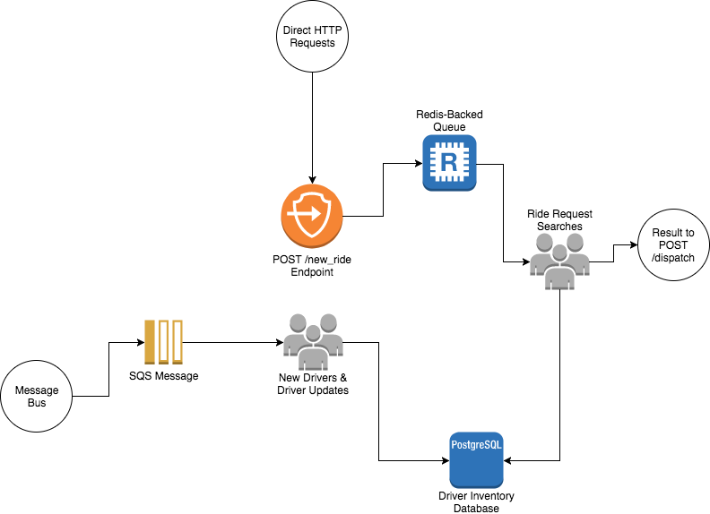
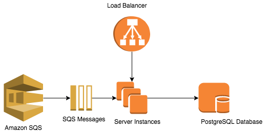
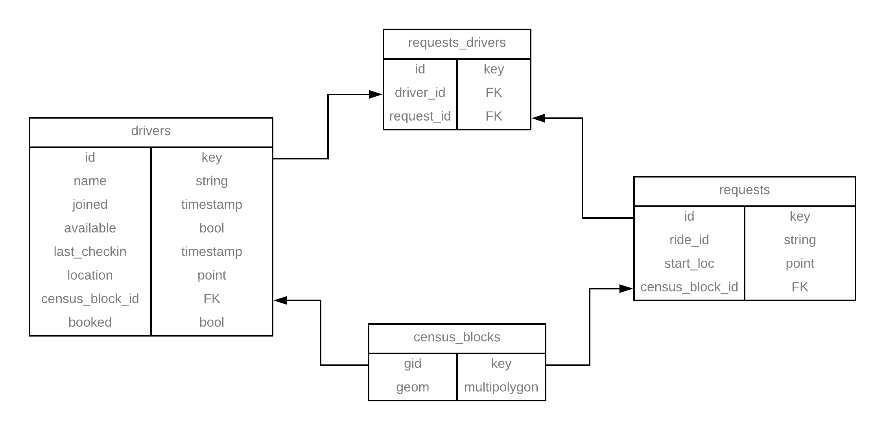

# ride-share

A driver inventory micro-service for a ride-sharing app clone.

## Contributors ##

Driver Inventory Micro-Service:
  - Katherine Manning

Rideshare App:
  - Katherine Manning (Driver Inventory)
  - Ayush Kumar (Analytics)
  - Edwin Chu (Rider Dispatch)
  - David Arellano (Driver Dispatch)

## Service Architecture ##

Requests come in via Amazon SQS messages and direct HTTP requests. Direct HTTP requests are added to a Redis queue before being processed.

When deployed, the service had multiple server instances to increase load capacity. A load balancer was used to direct HTTP requests to the least busy server. Redis and PostgreSQL were deployed to a separate EC2 instance. Server, databases, and load balancer were deployed in docker containers via Docker Cloud.

## Database Schema ##

Database is PostgreSQL with the PostGIS plugin for geospatial data. Census block shapefiles are free for download from [San Francisco County's website](https://data.sfgov.org/Geographic-Locations-and-Boundaries/Census-2010-Tracts-for-San-Francisco/rarb-5ahf/data).

